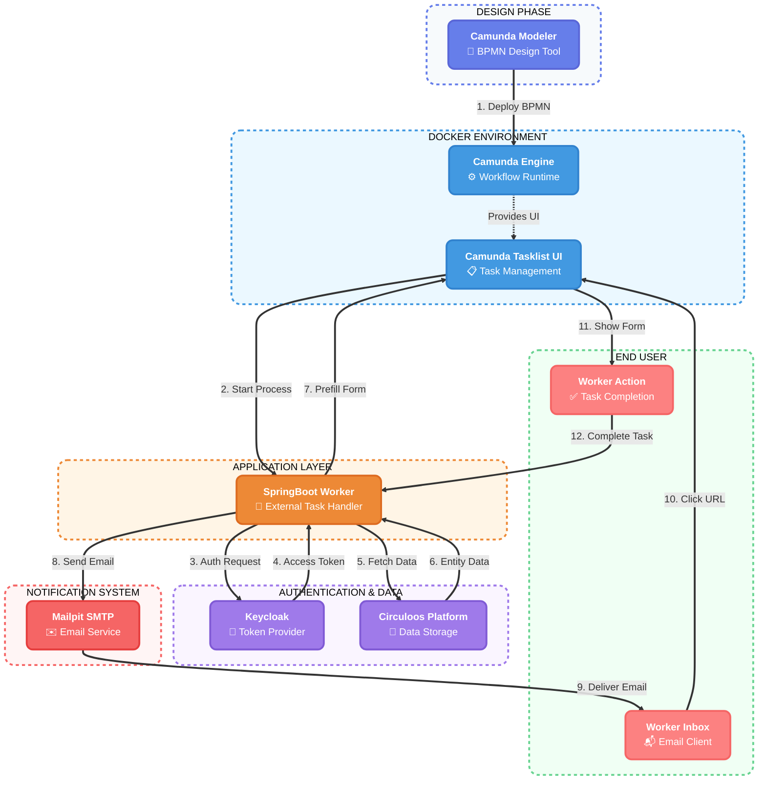

```mermaid
graph TB
%% === Subgraph Titles ===
subgraph design["<span style='color:black'>DESIGN PHASE</span>"]
A["<b>Camunda Modeler</b><br/>📐 BPMN Design Tool"]
end

    subgraph docker["<span style='color:black'>DOCKER ENVIRONMENT</span>"]
        direction TB
        C["<b>Camunda Engine</b><br/>⚙️ Workflow Runtime"]
        D["<b>Camunda Tasklist UI</b><br/>📋 Task Management"]
    end

    subgraph app["<span style='color:black'>APPLICATION LAYER</span>"]
        E["<b>SpringBoot Worker</b><br/>🔧 External Task Handler"]
    end

    subgraph auth["<span style='color:black'>AUTHENTICATION & DATA</span>"]
        direction TB
        G["<b>Keycloak</b><br/>🔑 Token Provider"]
        F["<b>Circuloos Platform</b><br/>💾 Data Storage"]
    end

    subgraph notify["<span style='color:black'>NOTIFICATION SYSTEM</span>"]
        H["<b>Mailpit SMTP</b><br/>✉️ Email Service"]
    end

    subgraph user["<span style='color:black'>END USER</span>"]
        direction TB
        I["<b>Worker Inbox</b><br/>📬 Email Client"]
        J["<b>Worker Action</b><br/>✅ Task Completion"]
    end

    %% === Flows ===
    A -->|"1. Deploy BPMN"| C
    C -.->|"Provides UI"| D
    D -->|"2. Start Process"| E

    E -->|"3. Auth Request"| G
    G -->|"4. Access Token"| E
    E -->|"5. Fetch Data"| F
    F -->|"6. Entity Data"| E

    E -->|"7. Prefill Form"| D
    E -->|"8. Send Email"| H
    H -->|"9. Deliver Email"| I

    I -->|"10. Click URL"| D
    D -->|"11. Show Form"| J
    J -->|"12. Complete Task"| E

    %% === Styles (preserved) ===
    style A fill:#667eea,stroke:#5a67d8,stroke-width:3px,color:#fff,rx:10,ry:10
    style C fill:#4299e1,stroke:#3182ce,stroke-width:3px,color:#fff,rx:10,ry:10
    style D fill:#4299e1,stroke:#3182ce,stroke-width:3px,color:#fff,rx:10,ry:10
    style E fill:#ed8936,stroke:#dd6b20,stroke-width:3px,color:#fff,rx:10,ry:10
    style F fill:#9f7aea,stroke:#805ad5,stroke-width:3px,color:#fff,rx:10,ry:10
    style G fill:#9f7aea,stroke:#805ad5,stroke-width:3px,color:#fff,rx:10,ry:10
    style H fill:#f56565,stroke:#e53e3e,stroke-width:3px,color:#fff,rx:10,ry:10
    style I fill:#fc8181,stroke:#f56565,stroke-width:3px,color:#fff,rx:10,ry:10
    style J fill:#fc8181,stroke:#f56565,stroke-width:3px,color:#fff,rx:10,ry:10

    style design fill:#f7fafc,stroke:#667eea,stroke-width:3px,stroke-dasharray: 5 5,rx:15,ry:15
    style docker fill:#ebf8ff,stroke:#4299e1,stroke-width:3px,stroke-dasharray: 5 5,rx:15,ry:15
    style app fill:#fff5e6,stroke:#ed8936,stroke-width:3px,stroke-dasharray: 5 5,rx:15,ry:15
    style auth fill:#faf5ff,stroke:#9f7aea,stroke-width:3px,stroke-dasharray: 5 5,rx:15,ry:15
    style notify fill:#fff5f5,stroke:#f56565,stroke-width:3px,stroke-dasharray: 5 5,rx:15,ry:15
    style user fill:#f0fff4,stroke:#68d391,stroke-width:3px,stroke-dasharray: 5 5,rx:15,ry:15

    linkStyle default stroke-width:3px
```